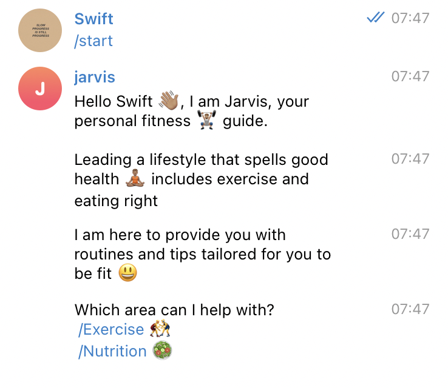
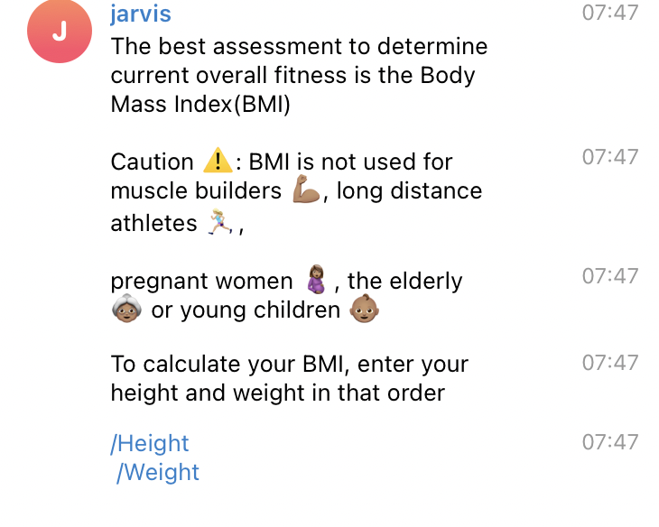
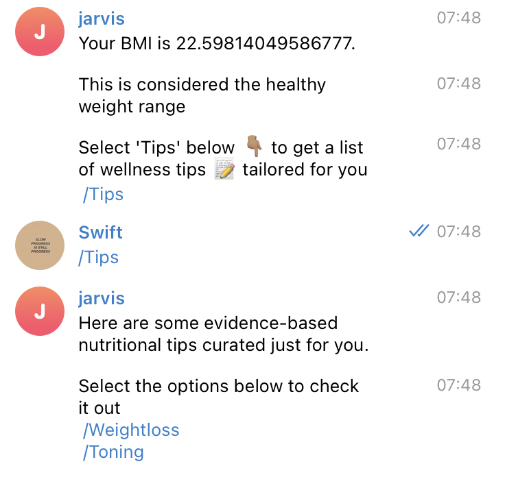

# Telegram Fitness Bot with Ruby

> 

## Built With

- Ruby

## Getting Started 

- Open your terminal - Windows: `Win + R`, then type `cmd` | Mac: `Command + space`, then type `Terminal`
- Navigate to a directory of your choosing using the `cd` command
- Run this command in your OS terminal: `git clone https://github.com/george-swift/` to get a copy of the project.
- Navigate to the project's directory using the `cd` command.
- Execute `./bin/bot.rb` or `cd bin` from the project's root folder and `ruby bot.rb`

### Prerequisites

* Internet connection
* Ruby installed in your OS

## Testing
- Open the terminal on the project root folder
- Execute `rspec --format doc` to run all the test cases  OR
- Run `bundle install` to install the required gems
- Execute `bundle exec rspec` to run all the test cases

👤 **Author**

- GitHub: [@george-swift](https://github.com/george-swift)
- Twitter: [@\_\_pragmaticdev](https://twitter.com/__pragmaticdev)

## 🤝 Contributing

Contributions, issues, and feature requests are welcome!

## Show your support

Kindly give a ⭐️ if you like this project!

## Acknowledgments