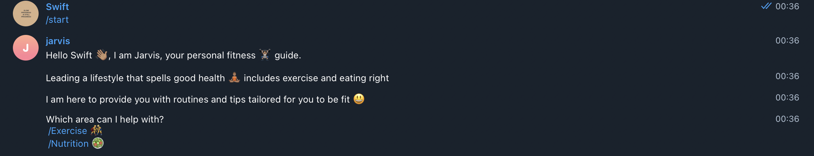
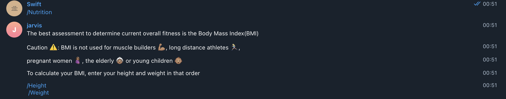

# Telegram Fitness Bot with Ruby
> A bot that shares tips on fitness and exercises. It calculates the Body Mass Index of a user given the required input i.e height and weight.

## Built With

- Ruby

## Getting Started 

- Search the Bot Father on Telegram and enter `/newbot`
- Follow the steps to get the token to access the API
- Open your terminal - Windows: `Win + R`, then type `cmd` | Mac: `Command + space`, then type `Terminal`
- Navigate to a directory of your choosing using the `cd` command
- Run this command in your OS terminal: `git clone https://github.com/george-swift/fitness-bot.git` to get a copy of the project.
- Navigate to the project's directory using the `cd` command.
- Create a `token.rb` file in the `lib` directory
- In this token.rb file, create a class called 'TokenConfiguration', with a method called 'token'.
- Paste the provided token in the method inside single quotes ' '.
- From your terminal move into the bin folder by using the `cd` command
- Execute `ruby bot.rb` in the terminal
- Search for your bot in Telegram
- Select the 'start' button to begin or type '/start' to begin
## Testing

- Open the terminal on the project root folder
- Execute `rspec --format doc` to run all the test cases  OR
- Execute `bundle exec rspec` to run all the test cases

👤 **Author**

- GitHub: [@george-swift](https://github.com/george-swift)
- Twitter: [@\_\_pragmaticdev](https://twitter.com/__pragmaticdev)

## 🤝 Contributing

Contributions, issues, and feature requests are welcome!

## Show your support

Kindly give a ⭐️ if you like this project!